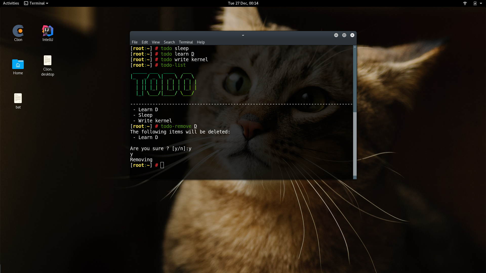

# Todo

todo do todo todo todo's

## What is this ?

I sought to create a simple terminal-based todo list, which ideally had minimal dependencies and was very easy to use.

## So what do I do to use it ?

Well run `bash install.sh` file, which installs it.

Then the following commands are there to be run:

- `todo`      
    + add to todo list
- `todo-list`
    + show list
- `todo-clear`
    + clears list
- `todo-remove`
    + removes items from list

Once you had enough run `bash uninstall.sh` to remove it again.

## How does this work ?

There is a todo file at `$TODO_FILE` (by default `~/.todo`) which is just line
seperated todo's. The scripts will take that file, add lines, remove them and enlist them.

Fairly simple stuff.

## Does this mean you can't program a proper program ?

Well I hope not, the reason to go for multiple bash scripts is the following:

- I was lazy
- This is simple
- I wanted the primary API to be something like `todo sleep`, with no command line flags
    like `todo --add sleep --quiet`, which is hard to do with a single script.
- I originally made it with just 4 aliasses in `.bashrc` but regretted it
    (I would not like to have large programs defined in `.bashrc`)
